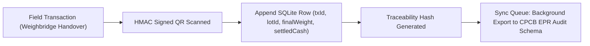

# Dataset Card: JNARDDC / PS 26229 E-Waste Price & Recycler Registry

**Version**: 1.0.0 (Living Dataset)  
**Maintenance Frequency**: Operational handover events trigger continuous SQLite append & weekly benchmark sync.  
**Geographical Scope**: Pune Municipal Corporation (PMC) & Pimpri Chinchwad Municipal Corporation (PCMC), Maharashtra, India.  

---

## 1. Dataset Summary & Provenance
| Dataset Component | File Location | Records | Primary Source |
|---|---|---|---|
| **Price Discovery Feed** | `assets/data/prices.json` | 10 E-Waste Categories | Field surveys across Nana Peth & Bhosari MIDC, cross-referenced with JNARDDC metals benchmark (Sept 2026). |
| **Authorized Recyclers** | `assets/data/recyclers.json` | 3 Tier-1 Facilities | CPCB Registered E-Waste Dismantler & Recycler Public Directory (Maharashtra State Pollution Control Board). |
| **Operational Transactions** | SQLite `transactions_ledger` | Dynamic (living) | Generated at point-of-handover between collector and recycler weighing scales. |
| **Traceability Chain** | SQLite `traceability_chain` | Dynamic (living) | Cryptographic HMAC-SHA256 tokens linked with GPS coordinates, timestamps, and weight photos. |

---

## 2. Living Dataset Lifecycle: How Data Grows in Operations

- Unlike static CSV dumps, the Kabadiwala Connect dataset is **operationally generated**.
- Every completed handover appends a tamper-evident row into the local SQLite store and outbox queue.
- Price feeds update dynamically with the **EPR Certificate Market Spot Price** (under E-Waste Management Rules 2022) and the **National Critical Minerals Mission (NCMM)** incentive component.

---

## 3. Data Schema & Variables
- `informalBaseRate` (₹/kg): Rate offered by unlicensed tier-3 middlemen.
- `formalGateRate` (₹/kg): Gate buying price at CPCB-authorized recycling plants.
- `eprCreditShare` (₹/kg): Producer Responsibility Organization (PRO) credit transferred to informal collectors.
- `ncmmIncentive` (₹/kg): Critical metals incentive for recovering Copper, Lithium, Gold, and Rare Earth Elements.
- `netOfferedPrice` (₹/kg): Total realizable price = `formalGateRate` + `eprCreditShare` + `ncmmIncentive`.

---

## 4. Known Biases & Honest Limitations
1. **Urban Industrial Focus**: Current data covers Pune and PCMC industrial belts (Bhosari, Hadapsar, Pimpri). It does not yet capture rural e-waste collection rates in interior Maharashtra.
2. **Exclusion of Battery Smelting Chemistry**: Lithium-ion rates reflect mixed-cell gross weight. Individual chemistry separation (NMC vs LFP) is not conducted at the collector tier due to safety risks.
3. **No Personal Identifiable Information (PII)**: All collector transactions use transient UUID identifiers (`COLL-PUN-XXXX`). No Aadhaar, phone numbers, or biometric data are stored in public datasets.
